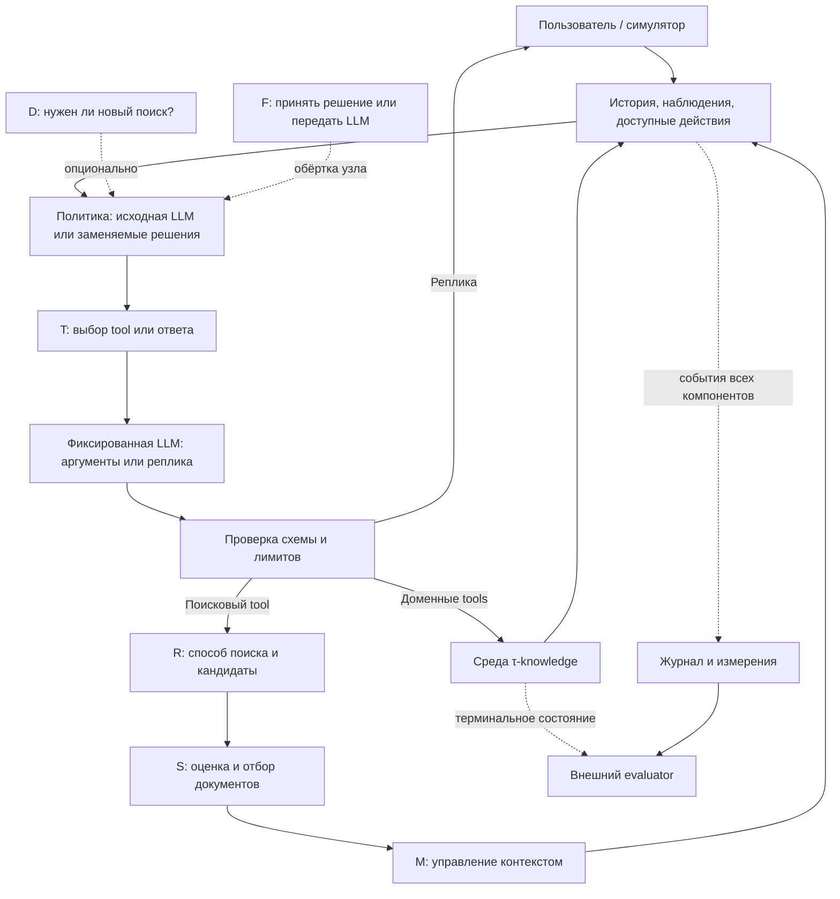

# Архитектура агента и программа экспериментов с System One

Версия **0.2 от 01.10.2026**. Спецификация для реализации и review;
код и измеренные результаты пока отсутствуют.

**Подтверждено инициатором:** исследовать несколько применений System One,
включая выбор tools и эффективность RAG; включить **τ-knowledge**.
Использовать open-source решения, Jev оставить только в обзоре.
Основная цель — снижать полную стоимость при ограниченной потере качества;
задержку измерять отдельно. Стенд — последовательные прогоны на Mac,
локальные решающие модели и допустимый API-хостинг открытой LLM.

**Изменение относительно v0.1:** платформа больше не ограничивается ответами
на вопросы HotpotQA. Ниже τ-knowledge предложен как основной сквозной стенд
для диалога, знаний и действий; прежний [протокол HotpotQA](hotpotqa-protocol.md)
сохранён как вспомогательный контролируемый стенд. Выбор реализаций и численных
параметров — предложения, пока не проверенные пилотом. Общие требования —
в [исследовании](research.md).

## 1. Исследовательский объект

Нужен один воспроизводимый языковой агент с несколькими заменяемыми местами
принятия решения. В конкретном опыте меняется выбранный узел, остальные условия
сохраняются. Общие функции измерений используются во всех сериях, но смысл успеха
задаёт соответствующий benchmark.

| Вариант | Применение в проекте |
| --- | --- |
| Исходный агент бенчмарка на открытой LLM | Обязательная точка отсчёта |
| Тот же агент с отдельными узлами выбора/оценки | Основной исследовательский вариант; замены System One, правилами и специализированными методами |
| Несколько автономных агентов | Только отдельная будущая гипотеза о делегировании; для выбора tools и RAG не требуется |

Исследовательская единица — полная задача/диалог, узловая единица — решение
в конкретном наблюдаемом состоянии. Дешёвый узел может сделать агента дороже,
если ошибки порождают новые поиски, исправления, реплики и вызовы.

## 2. Бенчмарки и границы оценки

### τ-knowledge

Используем домен `banking_knowledge` проекта Sierra `tau2-bench`, текстовый режим.
Поиск знаний связан с применением правил и действиями в симулируемой среде;
банковские операции выполняются только внутри бенчмарка. Статья описывает
698 документов и 97 задач в своей версии. Эти числа не заменяют инвентаризацию
выбранного commit. [Статья, arXiv:2603.04370v1][tau-paper]

Переиспользовать среду, задачи, симулятор пользователя, правила завершения и
оценщик upstream. Меняется исследуемый агент или объявленная часть retrieval.
Интерфейс подключения — `HalfDuplexAgent`, методы `get_init_state` и
`generate_next_message`; отдельный цикл симуляции не нужен. [Agent guide][tau-agent]

В upstream описано исправление оценки `banking_knowledge` в v1.0.1;
результаты до и после него объявлены несопоставимыми. Перед реализацией закрепить
точный commit с нужными исправлениями, хеши задач, корпуса, политик и evaluator.
Просмотренный `main` от 01.10.2026 — источник для проектирования, не закреплённая
зависимость запуска. [README upstream][tau-repo]

В базовом retrieval-условии явно выбрать `bm25`. Текущий default `alltools`
включает OpenAI embeddings, а готовые варианты `*_reranker` также требуют
OpenAI API. Они не подходят нашему ограничению без явной замены этих частей.
Открытый dense-retriever и наш postprocessor вводятся отдельными условиями.
[Конфигурации поиска][tau-knowledge]

Требование открытых весов/кода с проверенной лицензией относится к **агенту,
System One, embeddings, reranker, симулятору пользователя и LLM-judge**, если он
участвует. Внешний API допустим как хостинг открытой модели. Репозиторий τ-bench
имеет MIT; лицензии конкретных артефактов сохраняются в manifest. [Лицензия][tau-license]

Замена модели симулятора меняет условия эксперимента. Результаты на нашем открытом
симуляторе нельзя напрямую выдавать за воспроизведение чисел статьи/leaderboard.
Фиксируем один симулятор для всех вариантов и проверяем соблюдение сценария
на пилоте. Его скрытые инструкции не передаются исследуемому агенту.

### HotpotQA

Сохраняется для контролируемого отбора доказательств при известных ответах и
supporting facts. Здесь проще разделить потери поиска, ранжирования и генерации.
[Подробный протокол и источники](hotpotqa-protocol.md).

| Свойство | τ-knowledge | HotpotQA distractor |
| --- | --- | --- |
| Единица задачи | Многошаговый диалог в среде | Вопрос по заданным документам |
| Успех | Native evaluator и `reward_basis` задачи | Ответ и доказательства |
| Tools | Поиск и доменные действия | Поиск/чтение источников |
| Главная метрика | `pass^1`, дополнительно `pass^k` | Joint F1; строгий успех — joint EM |
| Выбор доменных tools | Полноценная сквозная проверка | Не проверяется |
| Два поиска из v0.1 | Не применяется | Стартовый параметр этого стенда |

Метрики двух стендов не усредняются в один «балл агента». HotpotQA не заменяет
проверку открытого baseline на τ-knowledge и не доказывает полезность выбора tools.

## 3. Общий цикл и заменяемые узлы

Это точки вмешательства, а не требование вызывать все узлы на каждом шаге.
При отключённых заменах сохраняется исходный цикл upstream. Нативный вызов LLM,
одновременно выбирающий tool и аргументы, остаётся отдельным baseline.

| Узел | Решение | Что остаётся у генеративной LLM |
| --- | --- | --- |
| T — tools | Выбор tool, shortlist или `respond` | Аргументы tool и текст реплики |
| R — retrieval routing | Выбор разрешённого способа поиска | Поисковый запрос |
| S — evidence selection | Оценка/ранжирование найденных документов | Применение правил и дальнейшее рассуждение |
| D — search control | Новый поиск или возврат управления агенту | Действие после завершения поиска |
| M — context selection | Какие прочитанные документы оставить в бюджете | Генерация сводки, если отдельно изучается суммаризация |
| F — fallback | Принять дешёвое решение или передать LLM | Повторное принятие того же решения |

System One выбирает в заданном пространстве ответов. В первой версии он не
генерирует произвольный JSON аргументов и не подменяет проверку политик.
Ошибки аргументов считаются отдельно от ошибок выбора имени tool.

Вход узла: доступный префикс диалога, наблюдённые результаты, ID прочитанных
документов, доступные описания tools, бюджет. Скрытая БД, будущие реплики,
gold documents и `evaluation_criteria` исключены. Если factory получает объект
задачи, адаптер не передаёт модели его привилегированные поля.

В τ-knowledge часть функций описана в документах и вызывается через
`call_discoverable_tool(name, kwargs)`. Нельзя заранее вручить селектору полный
скрытый каталог: это устранит часть задачи поиска знаний. Наши кандидаты берутся
из публичных tools среды и реально прочитанных описаний; происхождение сохраняется.
Native tool semantics и reward не меняются. [Механизм discovery][tau-paper]

Для длинной истории нужна подходящая модель либо общее для сравниваемых
селекторов преобразование состояния. LLM-компрессия добавляет вызов и стоимость.
Полный контекст у LLM против короткого у Laya — сравнение систем целиком;
для эффекта селектора нужен LLM-контроль на том же коротком входе.
Переполнение не обрезается незаметно: это событие и причина fallback.

## 4. Контракты и обработка ошибок

Переиспользуем native схемы сообщений/tools, registry и retrieval pipeline τ-bench.
Наш код добавляет функции решающих узлов и измерения. Отдельный сервер оркестрации,
универсальный plugin framework и процессы для каждого узла не требуются.

| Контракт узла | Вход | Выход |
| --- | --- | --- |
| `select_tool` | Видимое состояние и кандидаты | Один ID либо `respond/defer`; оценки при наличии |
| `rank_tools` | То же | Упорядоченные ID shortlist |
| `select_retrieval` | Состояние и разрешённые способы поиска | ID способа либо `defer` |
| `rank_documents` | Запрос/видимое состояние, кандидаты | Оценки известных document ID |
| `decide_search` | Состояние, найденные знания, бюджет | `search_more/return_to_agent/defer` |
| `select_context` | Наблюдённые документы, токенный бюджет | Подмножество ID и порядок, исходные тексты неизменны |

Общий результат: `node`, `input_hash`, `candidate_ids`, `selected_ids`,
`raw_scores`, при наличии `probabilities`, `calibration_id`, `fallback_reason`,
ссылки на события измерений. Это контракт данных, не требование иерархии классов.
Ранговый score не является вероятностью; независимые бинарные оценки кандидатов
не обязаны суммироваться в единицу.

Проверять принадлежность ID предъявленному набору, отсутствие дубликатов,
конечность чисел, диапазон вероятностей, native JSON Schema аргументов и лимиты.
Невалидный выбор передавать исходной LLM один раз; при повторной неудаче сохранить
ошибку/завершение по правилам адаптера. Не выбирать молча первый tool из списка.

Fallback по неопределённости — отдельный эксперимент с заранее выбранным порогом.
Технический fallback вызывается ошибкой, timeout или overflow. Причины, частоты
и расходы разделяются. При сбое reranker использовать исходный порядок целиком,
не смешивать несопоставимые оценки разных шкал.

Доменные записи исполняются только в экземпляре симулятора. После timeout записи
нельзя слепо повторять tool: действие могло примениться. Следовать контракту среды,
проверять состояние разрешёнными tools; не менять БД напрямую и не откатывать
неудачное действие вне траектории. Повторы чтения/модельных вызовов ограничить
и записывать, включая retries SDK.

Лимиты шагов, ошибок, токенов и времени τ-knowledge берутся из закреплённой
конфигурации upstream либо объявляются общим экспериментальным условием.
`2 поиска / 180 секунд / 2048 токенов` из HotpotQA сюда не переносятся.
Превышение лимита — измеряемый исход, не причина удалить пример.

## 5. Программа экспериментов

Серии ниже исследуются отдельно. Модели генерации аргументов/реплик и симулятора,
данные, бюджеты и evaluator сохраняются внутри сравнения.

| Серия | Вопрос | Изменяемый фактор | Контроли и кандидаты |
| --- | --- | --- | --- |
| E0 — baseline | Воспроизводится ли агент в открытом стеке? | Пока ничего | Native LLMAgent + BM25; открытый dense retrieval отдельным условием |
| E1 — shortlist tools | Можно ли сократить список без потери нужного действия? | `rank_tools` и размер shortlist | Полный список; лексическое ранжирование; энкодер/классификатор; Laya |
| E2 — выбор tool | Можно ли заменить выбор имени инструмента? | `select_tool`, заполнение аргументов фиксировано | LLM-селектор; правила/классификатор; Laya; также native LLMAgent |
| E3 — отбор RAG | Какие документы передавать агенту? | S при одинаковом кандидатном пуле | Исходный порядок; cross-encoder; открытая LLM; Laya |
| E4 — управление поиском | Когда искать ещё и каким способом? | Сначала D, отдельно R | Исходная политика; правило; LLM; Laya. Доступные способы поиска одинаковы |
| E5 — контекст | Что сохранять из уже найденного? | M при равном токенном бюджете | Native eviction; последние документы; ранговый отбор; Laya |
| E6 — калибровка/fallback | При каком охвате дешёвые решения полезны? | F поверх одного узла | Без fallback; сырые вероятности; калибровка; LLM-fallback |
| E7 — графовый поиск | Полезен ли выбор переходов по связям документов? | Графовый retrieval/оценка перехода | Обычный retrieval; наблюдаемые ссылки; специализированный score; Laya |

E1–E6 — кандидаты для пилотов. E7 условен: нужны воспроизводимые связи и
проверяемая постановка; взаимосвязанный корпус сам по себе не даёт gold-рёбра.
GraphRAG не обязан стать первой реализацией или отдельной ВКР.

Для E2 нужны **два контроля**: native LLM с совместным выбором имени/аргументов
и факторизованный вариант «LLM выбирает имя → та же LLM заполняет аргументы».
Первый показывает итоговую пользу модификации, второй выделяет эффект замены
селектора. Дополнительный вызов на аргументы может съесть экономию — это результат опыта.

В E1 размер shortlist выбирается на development. Переход к полному наблюдаемому
каталогу доступен сопоставляемым методам по одному правилу. Разделять исключение
допустимого tool из списка и ошибку LLM при достаточном списке.

В E3 фиксируются запрос, кандидатный пул и бюджет контекста. Offline-оценка
использует одинаковые входы; сквозная — собственные траектории каждой политики.
Gold-document recall τ-knowledge относится ко всей задаче, а не является готовой
per-query разметкой. Sentence-level диагностика с supporting facts — в HotpotQA.

Zero-shot, калибровка и обучение — разные условия. Обучение вводится при наличии
разрешённой разметки и отдельного бюджета. Laya — первый кандидат, не ограничение
исследования одним checkpoint; другие открытые модели добавляются по совместимости
входов, выходов, лицензий и ресурсов.

После одиночных замен — совместные абляции, например `T × S`: baseline,
только T, только S, T+S. Проверять взаимодействие; не складывать проценты
отдельных улучшений и не запускать все комбинации всех настроек сразу.

## 6. Формальная постановка и метрики

Для benchmark `b` политика `π` порождает траекторию задачи `x` с качеством `Qᵇπ(x)`,
стоимостью агента `Cᵇπ(x)` и задержкой `Tᵇπ(x)`. При одинаковой среде:

$$
\min_{\pi\in\Pi_b}\mathbb{E}[C^b_\pi(x)]\quad\text{при}\quad
\mathbb{E}[Q^b_\pi(x)-Q^b_{\pi_0}(x)]\geq-\varepsilon_b.
$$

Для τ-knowledge `Q` — бинарный успех по evaluator, для HotpotQA — joint F1.
`ε_tau` и `ε_hotpot` определяются отдельно до теста. Предложенные в v0.1
0.02 joint F1 не являются согласованным допуском по `pass^1`.
Задержка остаётся отдельной осью сравнения.

### Сквозной успех

Использовать `reward_basis` задачи и native evaluator: проверка может включать
БД, assertions, коммуникацию и действия. Не заменять её качеством текста
или только хешем БД. `actions` обычно задаёт одну эталонную траекторию;
совпадение действий обязательно там, где оно включено в критерий задачи.
[Семантика оценки][tau-evaluation]

При `n_i` повторах задачи `i` и `c_i` успехах:

$$
\widehat{\mathrm{pass}^k}=
\frac1N\sum_{i=1}^N\frac{\binom{c_i}{k}}{\binom{n_i}{k}},\quad n_i\geq k.
$$

`pass^1` — основной показатель; `pass^2/pass^4` — надёжность при достаточном
числе повторов. `pass^k` требует успеха во всех `k` попытках, не хотя бы одного,
как `pass@k`. Критерий успеха и формулу сверять с кодом. [Native metrics][tau-metrics]

Upstream исключает `INFRASTRUCTURE_ERROR` из части агрегатов. Сохранять отдельно
native-метрики со списком исключений и операционную долю успехов среди всех
заранее назначенных попыток, где инфраструктурный сбой/timeout — неуспех.
Вторую не называть официальным `pass^k`; расходы исключённых попыток не удалять.
При незавершённой серии сообщать неполноту и покрытие каждого метода.

### Диагностика узлов

| Объект | Метрики | Ограничение интерпретации |
| --- | --- | --- |
| Shortlist | Recall допустимых tools@k, размер/токены списка, fallback | Допустимые действия требуют разметки наблюдаемого состояния |
| Выбор tool | Доля допустимых выборов; macro-F1 на однозначных классах; недопустимые вызовы | Reference next tool не всегда единственно правильный |
| Аргументы | Schema-valid rate, ошибки полей и доменные ошибки | Схема не доказывает правильность действия |
| Retrieval | Candidate recall, gold-document recall за траекторию, полнота после отбора, число поисков | Считать попадание в реальный контекст, а не только в скрытый пул |
| Ранжирование | nDCG/average precision при подходящей разметке | Gold всей задачи не автоматически per-turn relevance |
| Поиск/контекст | Преждевременная остановка, повторные чтения, удаление нужного документа | Для «нужного» требуется эталон или отдельная разметка |
| Вероятности | Brier, log loss, reliability diagram | Только по определённой метке; rank score не равен вероятности |
| Fallback | Риск–охват, доля/стоимость передач, качество после передачи | При нулевом охвате риск не определён |

Для tools подготовить небольшую размеченную коллекцию development-префиксов
с множеством допустимых действий и неоднозначностями. Reference/teacher outputs —
кандидаты для проверки, не безошибочные метки. При нескольких правильных действиях
не назначать произвольный единственный класс для NLL/Brier. Возможный выход —
бинарная полезность каждого кандидата; иначе оценивать принадлежность выбранного
действия допустимому набору.

Метрики без подходящей разметки помечать «не измерены», не заменять их самооценкой.
Native reward остаётся доступным для сквозной оценки. Нарушения политик вне
покрытия evaluator проверяются отдельным аудитом; положительный reward не доказывает их отсутствия.

### Стоимость и задержка

Разделять `C_agent`, `C_user_simulator`, `C_evaluator`, `C_setup`.
В основном ограничении оптимизируется `C_agent`; бюджет исследования учитывает
все части. Стоимость агента включает поиск, embeddings запросов, управление
контекстом, неуспешные вызовы, retries и fallback.

$$
C_{\mathrm{per\ success}}=
\frac{\sum C_{\mathrm{agent}}}{\#\{\text{успешных выполнений}\}}.
$$

Отдельно публиковать аналогичный показатель для всех расходов стенда. При нуле
успехов он не определён. Денежные списания и локальное CPU/MPS/GPU-время показывать
раздельно; монетизация оборудования требует явной ставки. Окупаемость setup
существует при положительной экономии inference и сохранении качества.

Измерять p50/p95 полного диалога, активного времени агента с tools и ответа
на реплику. Время симулятора/evaluator выделять отдельно; родительские и дочерние
интервалы не суммировать с двойным счётом. Показывать успешные и все терминальные
исходы, timeout rate, cold/warm режим и условия параллелизма.

## 7. Протокол сравнения и статистика

Состав задач, splits и gold metadata проверяются у закреплённой версии.
`base` — полный набор для оценки, его нельзя автоматически считать обучающим split.
[Структура доменов][tau-domains], [README][tau-repo]

Для настраиваемых решений разделить task-family группы на обучение, калибровку,
выбор конфигурации и итоговую оценку. Все префиксы, парафразы и повторы одной
задачи остаются в её группе. Доли и ID фиксируются после инвентаризации, до
сравнительных результатов. Малый набор ограничивает точность выводов;
собственное разбиение не объявлять официальным leaderboard split.

Альтернатива zero-shot серии — весь `base` как evaluation с настройкой на внешних
или отдельно созданных development-задачах. Нельзя подобрать пороги на `base`
и назвать оценку на нём независимым тестом. Просмотренные для отладки gold-задачи
включаются в development manifest.

Доступный корпус одинаков для политик. Gold documents, эталонные действия и
инструкции симулятора скрыты от агента. Gold-контекст допустим лишь как отдельно
помеченная диагностика. Граф строится по разрешённому корпусу/ссылкам,
не по gold documents и траекториям теста.

До теста каждой серии закрепить вопрос, primary metric/сравнение, `ε`,
конфигурацию и повторы. Технический пилот τ-knowledge — несколько development-
задач разных сценариев и один повтор для проверки tools, симулятора, стоимости
и длины диалога. Для `pass^4` нужны минимум четыре повтора каждой задачи,
что заранее входит в бюджет. Пилот не объявляется итоговой оценкой.

Исполнять одинаковые task IDs и наборы seed; фиксировать симулятор и параметры.
Seed не гарантирует одинаковые реплики при разных траекториях; baseline-реплики
нельзя вслепую переигрывать в другой среде. Порядок методов рандомизировать
в блоках; конкурентные нагрузки на Mac исключить при измерении задержки.

Использовать парные интервалы разницы качества/стоимости: bootstrap по task-family
группам с повторами внутри группы, например 10 000 перевыборок с фиксированным seed.
Число независимых наблюдений — задачи/семейства, не все tool calls. Публиковать
ширину интервала и предел обнаружимого эффекта. Качество подтверждается нижней
границей `ΔQ > −ε`, экономия — верхней границей `ΔC < 0`; иначе вывод может быть
«недостаточно данных». Простое отсутствие значимой разницы не доказывает эквивалентность.
При редких/нулевых успехах и вырожденных bootstrap-интервалах этого расчёта
недостаточно для подтверждения гипотезы: нужны дополнительные независимые задачи
или подходящий для границы параметра метод интервалов, заданный до итогового вывода.

Многочисленные поисковые эксперименты отделять от подтверждающих. До итогового
теста определить семейства гипотез и правило множественных сравнений, например
Holm для подтверждающих тестов. Результаты теста не использовать для новой настройки
с последующим заявлением о независимой проверке на тех же задачах.
Выигрыш у дорогой LLM не доказывает преимущества над дешёвым классификатором/reranker.

Сохранять отрицательные результаты, shift на собственных траекториях, ошибки
симулятора и зависимость от длины истории/числа tools. Открытость весов не гарантирует
отсутствия benchmark в предобучении.

## 8. Журнал, бюджет и последовательность реализации

Сохранять [запись эксперимента](research.md#запись-эксперимента) и дополнительно:

- Commit upstream/агента, retrieval/evaluator config, split, хеши корпуса,
  БД, политик, prompts, tool schemas, весов, калибраторов.
- Модели **всех ролей**, provider, device/dtype/quantization, преобразования
  входа; неизвестную ревизию API-хостинга явно отмечать.
- `run_id/task_id/trial_id/step_id/node/event_id/parent_event_id`, хеш входа,
  предъявленные кандидаты, выбранное действие, реальные аргументы tool.
- Документы до/после отбора, raw/calibrated scores, причины fallback/overflow/retry,
  терминальный статус и компоненты reward.
- Токены, тариф/дату/валюту, списания, длительности и принадлежность затрат
  агенту, пользователю, evaluator или setup. Неизвестные расходы не равны нулю.

Native trajectories сохраняются вместе с дополнительным журналом. Не подменять
неудачные прогоны удачными перезапусками. В Git — разрешённые manifests,
конфигурации и сводки; большие данные/веса — вне Git.

Последовательность реализации:

1. Закрепить upstream, лицензии, reward dependencies; подключить открытые модели
   агента/пользователя и явно выбрать BM25. Если LLM-judge входит в reward задачи,
   использовать проверенный открытый judge и объявить изменённое условие;
   обязательный компонент не отключать. Необязательный диагностический judge
   можно отключить с записью этого решения.
2. Получить native E0 и журнал на малом пилоте. Qwen3-8B из v0.1 — кандидат
   для smoke-test, не заранее достаточная модель для τ-knowledge. При необходимости
   выбрать более сильную открытую LLM через API до итогового сравнения.
   Нулевой успех baseline на пилоте — повод диагностировать общую выполнимость,
   а не объявлять полезным столь же неуспешный, но более дешёвый агент.
3. Ввести одну замену: E1 или E3, затем E2. HotpotQA-пилот выполняется по
   отдельному протоколу; его результат не заменяет сквозной опыт τ-knowledge.
4. После устойчивого baseline — E4–E6, одиночные замены и совместные абляции.
   E7 — после проверки графовых данных.

Бюджет: задачи × варианты × повторы × средняя стоимость диалога с симулятором
и оценкой, плюс setup и резерв. До первого платного пилота использовать верхние
границы вызовов/токенов, установить денежный cap и остановку до его превышения.
API-бюджет пока не установлен; 30 000 ₽ возможной аренды GPU не являются лимитом API.

Минимальные проверки будущего кода: baseline не меняется при отключённых hooks;
gold-поля не попадают во входы; discovery и схемы tools соблюдаются; ошибки выбора
и аргументов разделяются; retries/fallback учитываются; лимиты завершают цикл;
reward и `pass^k` совпадают с evaluator на ручных примерах.

## 9. Самостоятельные исследования и статус

Возможные самостоятельные вопросы: tools (E1/E2), retrieval/контекст (E3–E5),
калибровка/селективные решения (E6) либо проверяемый GraphRAG (E7).
Назначения авторам нет. Общий стенд не заменяет собственную гипотезу, протокол
и вывод каждого автора. [Правила команды](team.md).

Спецификация включает τ-knowledge и сохраняет HotpotQA. Она не требует реализовать
все серии до первой ВКР или создавать универсального агента. Перед основными опытами
остаются: точный commit, модели всех ролей, split/разметка узлов, допуски качества,
число повторов и бюджет. Их выбирают пилотом до итогового теста.

Самопроверка: native reward отделён от локальной точности tools; симулятор включён
в бюджет; скрытый каталог не раскрывается; HotpotQA-лимиты отделены от τ-knowledge.
Review участника и проверка реализацией ещё не выполнены.

## Источники

Проверены **01.10.2026**. Статья и upstream-код — внешние источники, не наши измерения;
`main` требуется заменить точной ревизией в manifest запуска.

- [Shi et al., τ-Knowledge, arXiv:2603.04370v1][tau-paper] — постановка.
- [τ-bench README][tau-repo] — домен, версии и изменение grading.
- [Knowledge retrieval][tau-knowledge] — режимы и зависимости поиска.
- [Agent developer guide][tau-agent] — интеграция агента.
- [Task schema and evaluation][tau-evaluation] — `actions` и `reward_basis`.
- [Agent metrics][tau-metrics] — `pass^k` и инфраструктурные исключения.
- [Evaluator][tau-evaluator] — состав проверок.
- [Domain structure][tau-domains], [MIT license][tau-license] — данные и лицензия.
- Источники HotpotQA и кандидатов моделей — в [его протоколе](hotpotqa-protocol.md#источники).

[tau-paper]: https://arxiv.org/html/2603.04370v1
[tau-repo]: https://github.com/sierra-research/tau2-bench
[tau-knowledge]: https://github.com/sierra-research/tau2-bench/blob/main/src/tau2/knowledge/README.md
[tau-agent]: https://github.com/sierra-research/tau2-bench/blob/main/src/tau2/agent/README.md
[tau-evaluation]: https://github.com/sierra-research/tau2-bench/blob/main/docs/evaluation.md
[tau-metrics]: https://github.com/sierra-research/tau2-bench/blob/main/src/tau2/metrics/agent_metrics.py
[tau-evaluator]: https://github.com/sierra-research/tau2-bench/blob/main/src/tau2/evaluator/evaluator.py
[tau-domains]: https://github.com/sierra-research/tau2-bench/blob/main/src/tau2/domains/README.md
[tau-license]: https://github.com/sierra-research/tau2-bench/blob/main/LICENSE
