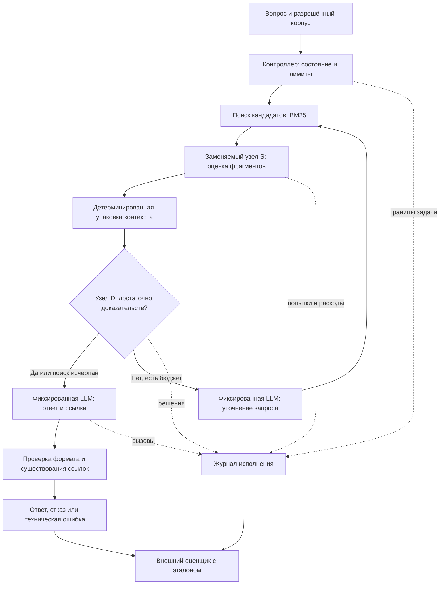

# Вспомогательный протокол HotpotQA

Версия 0.1, область применения уточнена **01.10.2026**.
Это сохранённая спецификация контролируемого стенда для отбора RAG-контекста,
а не архитектура всей исследовательской платформы. Основная архитектура,
эксперименты с tools и τ-knowledge находятся в [общей спецификации](architecture.md).

HotpotQA, приведённые модели и параметры остаются предложением для пилота.
Ограничение в два поиска, sentence-level метрики и допуск по joint F1 применяются
только здесь; переносить их на τ-knowledge нельзя. Реализация и результаты отсутствуют.
Общие ограничения и подтверждённые решения — в [wiki](README.md).

## 1. Назначение вспомогательного стенда

Агент получает вопрос и доступ к фиксированному набору документов, находит
доказательства, при необходимости выполняет ещё один поиск и выдаёт краткий ответ
со ссылками на предложения источников. Если доказательств не хватает, допускается
явный отказ от ответа. В основной оценке на ответимых вопросах отказ считается неуспехом.

| Подход | Что позволяет измерить | Решение для первой версии |
| --- | --- | --- |
| Однопроходный поиск → контекст → ответ | Влияние отбора контекста; самый простой контроль | Оставить как обязательную дешёвую альтернативу |
| Один агент с ограниченным повторным поиском | Отбор контекста и решение о продолжении; последствия ошибки на всей траектории | Архитектура этого стенда |
| Координатор и несколько автономных специалистов | Делегирование и координацию, но добавляет изменяемые факторы и расходы | Отложить до отдельной гипотезы о делегировании |

Управление выполняет обычная программа. Поиск, проверка формата и сбор метрик —
функции программы, а не дополнительные языковые агенты. Экспериментальная единица —
одно полное выполнение вопроса. Первый заменяемый узел в этом стенде — **оценка полезности фрагмента
для ответа**. Второй самостоятельный эксперимент — решение о дополнительном поиске.

Математическое содержание: ранжирование при ограниченном контексте, калибровка
вероятностей, селективное принятие решений и сравнение политик при ограничении
на потерю качества. Новизна проверяется по постановке и результатам, не выводится
из самого использования Laya или другого System One кандидата.

## 2. Задача и данные

Первый предлагаемый режим — **HotpotQA distractor**: английские вопросы, заданный
для каждого вопроса набор из десяти абзацев, эталон ответа и supporting facts.
Источники: [статья Yang et al., EMNLP 2018][hotpot-paper], [страница датасета][hotpot].
Это задача поиска доказательств внутри предоставленного набора. Результаты первой
серии не переносятся автоматически на поиск по всей Wikipedia, русский язык
или пользовательские документы.

Единица поиска и цитирования — предложение с исходным идентификатором
`(title, sentence_id)`. Внутренний `source_id` однозначно отображается в эту пару
и в хеш версии текста. Исходное разбиение на предложения сохраняется.
В приложении источник показывается как название документа и предложение,
с привязкой к сохранённому снимку; текущая веб-страница не заменяет снимок.

Агент видит только вопрос, тексты и идентификаторы разрешённых источников.
`answer`, `supporting_facts`, тип сложности и результаты проверки доступны
только оценщику вне процесса принятия решений. Набор документов не формируется
по эталону во время запуска. Все методы получают одинаковый разрешённый набор.

Подготовка данных:

1. Зафиксировать исходные файлы, URL, дату, контрольные суммы и лицензию.
   Данные HotpotQA опубликованы под CC BY-SA 4.0; код официального проекта —
   под Apache-2.0. Сохранять атрибуцию отдельно для данных и кода. [Источник][hotpot-repo]
2. Из официального train сформировать `fit`, `calibration`, `selection`
   в пропорции 60/20/20 по группам вопросов с фиксированным seed `20261001`.
   `fit` нужен для обучаемых дешёвых методов; `calibration` — для вероятностей;
   `selection` — для выбора порогов и конфигурации. Zero-shot условия не обучаются на `fit`.
3. Дубликаты и производные одного вопроса держать в одной группе; сохранять
   явный manifest ID и проверку пересечений. Совпадающие вопросы между train
   и будущей тестовой частью исключать из настройки, не из оценки после получения результата.
   Общие документы допустимы в режиме общего корпуса; их пересечение публиковать,
   не называя эксперимент проверкой на совершенно новых документах.
4. Официальный dev использовать как закрытую до фиксации протокола **тестовую часть
   нашего исследования**. Если бюджет требует подвыборку, определить её ID заранее
   без просмотра ответов моделей. Это не официальный скрытый test и не результат leaderboard.
5. Пилот: 100 вопросов из `fit` с сохранёнными ID и представительством типов
   bridge/comparison, без отбора по успеху метода. При нехватке ресурсов уменьшить
   число до запуска и записать причину. Размер итоговой выборки определить после пилота.

Для первого узла метка `y(q,d)=1`, если предложение `d` включено в supporting facts
вопроса `q`. Это воспроизводимая разметка участия в эталонном доказательстве,
а не исчерпывающая разметка всех допустимых объяснений. Ошибки и альтернативные
доказательства исследуются отдельно на вручную проверенной подвыборке.

HotpotQA — публичный benchmark; его присутствие в предобучении выбранных моделей
не исключено. Разбиение нашего эксперимента защищает от утечки при нашей настройке,
но не доказывает отсутствие предобучающего запоминания. Этот предел вывода указывать
в ВКР; при необходимости отдельно проверить ответы без контекста и перенос
на другой корпус, не смешивая эти проверки с основной серией.

## 3. Компоненты и поток выполнения

В журнал также попадают поиск, упаковка, уточнение запроса и проверки.
Оценщик запускается после исполнения; его результаты не возвращаются агенту.

| Компонент | Ответственность | Что остаётся фиксированным в эксперименте S |
| --- | --- | --- |
| Загрузчик | Разделяет данные агента и эталоны; проверяет manifest | Корпус, вопросы, разбиение, ID |
| Контроллер | Выполняет переходы, проверяет бюджет, завершает задачу | Правила переходов и лимиты |
| Поиск R | Возвращает кандидатов и исходные тексты | Индекс, токенизация, запрос, top-k |
| Оценщик S | Оценивает участие каждого кандидата в доказательстве | Меняется только метод оценки |
| Упаковка P | Выбирает контекст в пределах токенного бюджета | Порядок, tie-break, правила вместимости |
| Решение D | Выбирает `answer` или `search_more` | Одна LLM, версия и промпт |
| Уточнение W | Формирует один новый поисковый запрос | Одна LLM, версия и промпт |
| Генератор A | Возвращает краткий ответ и ID доказательств | Одна LLM, версия, промпт и параметры |
| Проверка V | Проверяет контракт и принадлежность ссылок контексту | Детерминированные правила |
| Оценщик эксперимента | Сопоставляет ответ/ссылки с эталоном и считает затраты | Одна версия метрик для всех методов |

«Фиксированный компонент» означает одинаковый алгоритм и настройки.
Его вход и поведение могут измениться вследствие замены S: именно это влияние
проверяется в сквозном эксперименте. Не подменять такой прогон воспроизведением
траектории исходного агента.

Алгоритм одного выполнения:

1. Проверить вход, назначить `task_id`, `run_id`, deadline и бюджет. Состояние:
   вопрос, ссылка на корпус, увиденные кандидаты, оценки, выбранный контекст,
   номер поиска и накопленные расходы. Память между вопросами отсутствует.
2. Первый запрос — исходный вопрос. Поиск возвращает до 20 предложений.
   Повторный поиск возвращает до 20 ещё не рассмотренных предложений.
3. S оценивает пары `(исходный вопрос, название, предложение)` независимо.
   Семантически одинаковый текст передаётся всем методам; пакетирование не должно
   давать одному методу дополнительные соседние предложения. Оценки уже виденных
   пар внутри задачи переиспользуются всеми вариантами по одному правилу.
4. Объединить кандидатов двух поисков, отсортировать по убыванию оценки,
   при равенстве — по `source_id`. Последовательно добавлять целые предложения
   в контекст до лимита 2048 токенов токенизатора генератора, включая названия и ID.
   Не помещающееся предложение пропустить и продолжить; не обрезать его незаметно.
   Это жадная эвристика, не решение оптимальной задачи выбора подмножества.
5. После первого поиска D решает, достаточно ли доказательств. При `search_more`
   W создаёт новый запрос по вопросу и выбранному контексту; R выполняет второй поиск.
   Повторный идентичный запрос без новых кандидатов не запускает бесконечный цикл.
6. После второго поиска либо решения `answer` вызвать A один раз. Генератор
   может ответить или явно отказаться. Исчерпание поиска не является доказательством
   достаточности контекста. При пустом контексте завершить явным отказом без вызова A.
7. Проверить контракт результата. Сохранить терминальный статус, все попытки,
   длительности и расходы. Отдельный оценщик вычисляет качество по эталону.

**Стартовые параметры пилота, не достигнутые показатели:** два поиска,
20 новых кандидатов на поиск, 2048 токенов доказательств; лимиты выходов
S/D — 64 токена, W — 256, A — 512;
одна задача одновременно, batch size 1 для сравнения задержки решающих узлов.
Максимум 180 секунд на задачу, 30 секунд на API-попытку с учётом остатка deadline.
Если технический пилот требует изменить параметры, зафиксировать новую конфигурацию
до сравнительной серии и применить её ко всем вариантам.

## 4. Контракты и реализация стенда

Предлагается Python, локальные JSON/JSONL и SQLite FTS5 для полнотекстового поиска.
FTS5 предоставляет `bm25()`; его знак и порядок сортировки учитывать явно
при приведении к правилу «больше — лучше». [Документация SQLite][fts5]
Доступность FTS5 и выполнение локальных моделей на M4 Pro проверяются пилотом.
Векторная БД, отдельные сервисы, очереди, долговременная память и фреймворк
мультиагентной оркестрации для этой версии не требуются.

Контракты ниже — спецификация будущих функций, не существующий API проекта.
Для всех объектов запрещены неожиданные поля; числовые значения должны быть конечными.

| Функция | Вход | Выход и проверка |
| --- | --- | --- |
| `search` | Разрешённый `corpus_id`, строка `query`, `exclude_ids`, `limit` от 1 до 20 | Список уникальных `{source_id, title, sentence_id, text, retrieval_score}`; ID только из корпуса |
| `score_fragment` | `question`, `source_id`, `title`, `text` | `{source_id, score, p_relevant}`; `score` — число для ранжирования, `p_relevant` — число в [0,1] или `null` |
| `decide_next` | `question`, выбранные источники, оставшийся бюджет поиска | `{action, p_sufficient}`; `action` из `answer/search_more`, вероятность в [0,1] или `null` |
| `rewrite_query` | `question`, выбранные источники, предыдущий запрос | `{query}`; непустая строка до 1000 символов |
| `answer` | `question`, выбранные источники | `{status, answer, citations}`; статус `answered/abstained`, ссылки — уникальные `source_id` из переданного контекста |

Для `answered` обязательны непустой ответ и хотя бы одна ссылка; для `abstained`
ответ и список ссылок пусты. `sentence_id` — целое неотрицательное число.
Входной вопрос и поисковый запрос ограничить 1000 символами; превышение не обрезать,
а регистрировать как `invalid_input`. Проверить охват данных этим лимитом до серии.
Сохранить исходные provider response и результат нормализации для аудита.

Терминальные состояния исполнения: `answered`, `abstained`, `invalid_output`,
`invalid_input`, `timeout`, `provider_error`, `budget_exceeded`.
`answered` означает корректный формат ответа, а не доказанную правильность.

LLM вызывается через OpenAI-совместимый интерфейс со структурированным JSON-выходом.
Контроллер сам вызывает разрешённые функции; свободного выполнения кода моделью нет.
В OpenRouter поддержка JSON Schema зависит от модели/провайдера; это проверка
совместимости перед выбором конкретной LLM. [Документация OpenRouter][openrouter]
Фиксировать модель и обслуживающего провайдера; автоматическую смену провайдера
отключить, если возможно, иначе явно учитывать как отдельное условие.

Кандидат общей LLM — `Qwen/Qwen3-8B`: открытые веса под Apache-2.0 и доступный
код семейства. [Карточка][qwen], [репозиторий][qwen-code]
В пилоте использовать один закреплённый режим без thinking для S/D/W/A;
зафиксировать chat template, параметры декодирования и ограничение выхода каждого узла.
Это стартовый baseline, его достаточность для задачи проверяется пилотом.
Если качество требует другой открытой LLM, заменить её во всех условиях до теста.
Размещение через API не гарантирует знания точной ревизии или квантизации:
эти неизвестные отмечать; локальное исполнение с закреплёнными весами — способ
устранить их. Локальный квантизованный и API-вариант не считать одной конфигурацией.

Jev остаётся только источником для обзора типизированных решений и интерфейсов.
Его вызовы, адаптер, ключ и закрытый baseline не нужны. Наличие открытых весов
у выбранных моделей не означает доступности всего исходного обучающего корпуса;
в ВКР точно указывать, какие части доступны для воспроизведения.

Для Laya явно выбрать checkpoint и ревизию весов; не включать скрытую автоматическую
смену checkpoint по языку. У английского варианта в карточке указан контекст 512
токенов; у multilingual — другие ограничения. Поэтому первым узлом выбрана короткая
пара вопрос–предложение. Возможности длинного контекста и MPS — предмет проверки,
а не предположение о совместимости. Веса и код Laya опубликованы под Apache-2.0;
лицензии закрепить вместе с выбранной ревизией. [Карточка модели][laya], [код][laya-code]

Считать длину полного сериализованного входа, включая вопрос и критерии, каждым
нужным токенизатором. При превышении окна не применять скрытое truncation:
записать `input_overflow` и задействовать предусмотренный технический fallback.
Отдельно показать результаты на общей подвыборке, помещающейся во все модели,
и на всей выборке с учётом fallback; основной сквозной показатель — на всей выборке.

Поиск только читает фиксированный индекс. Строки запросов параметризуются,
операторы FTS из пользовательского текста экранируются. Тексты документов считаются
данными, а не инструкциями управления. Агент не получает произвольный shell,
сетевые адреса или операции записи; ключи не попадают в промпты и журналы.

## 5. Сбои, неопределённость и завершение

Разделять два вида перехода к запасному методу:

- **Технический fallback:** невалидный ответ решающего узла, переполнение контекста
  или исчерпанные попытки обращения. При сбое S перейти на BM25 для всего текущего
  набора и оставшихся этапов этой задачи, сохранив расходы уже выполненных оценок;
  не смешивать несопоставимые BM25-score и модельные вероятности в одном ранжировании.
  Для D — дополнительный поиск, если он доступен, иначе A. Ошибка W завершает
  уточнение и переводит к A с уже найденными источниками. Ошибка A завершает
  задачу техническим неуспехом. Все замены имеют отдельный reason в журнале.
- **Fallback по неопределённости:** отдельное экспериментальное условие S или D.
  После дешёвой модели решение передаётся фиксированной LLM только при попадании
  в заранее выбранную область неопределённости. Записываются оба вызова и их расходы.
  Ошибка запасной LLM приводит к тому же техническому fallback, без рекурсии.

Для временной транспортной ошибки/429/5xx разрешить одну повторную API-попытку,
если хватает deadline и бюджета. Задержка берётся из `Retry-After`, а при отсутствии
заголовка — 1 секунда. Если ожидание не помещается в deadline, повтор отменяется.
Ошибки авторизации и неверной конфигурации останавливают серию. Невалидный JSON
не исправлять повторными генерациями без отражения этого как нового условия.
Встроенные повторы SDK отключить либо включить каждую попытку в журнал.

У адаптера Laya извлекать бинарную вероятность участия фрагмента в доказательстве
из документированного выхода выбранной версии; не подменять её произвольным
полем `confidence`. Проверять калибровку относительно конкретной метки.
Самооценка вероятности LLM также является прогнозом для проверки, а не эталоном.
Ранговый score BM25 или cross-encoder не объявлять вероятностью без калибровки.

Порог передачи выбирать на `selection`, калибратор обучать на `calibration`.
Первый предлагаемый калибратор — temperature scaling бинарного logit:
`p_cal = sigmoid(logit(p_raw) / T)`, `T > 0` минимизирует NLL на `calibration`.
Вероятности 0/1 перед logit ограничить интервалом `[10⁻⁶, 1−10⁻⁶]`.
Для смешанного ранжирования в `selective` отдельно откалибровать Laya и запасную
LLM на одинаковой задаче; сохранять происхождение каждого итогового score.
Уверенность бинарного решения — `max(p_cal, 1−p_cal)`, fallback срабатывает при
значении ниже `τ`; в остальных случаях score равен `p_cal`. Калибровка не является
гарантией улучшения; сравнить также исходные вероятности. [Guo et al., 2017][calibration]

## 6. Формальная постановка и метрики

Пусть `x` — вопрос с разрешённым корпусом, `π` — полная политика исполнения,
`π₀` — исходный агент с LLM в узле S. Пусть `Qπ(x)` — joint F1 ответа и доказательств
на шкале [0,1], `Cπ(x)` — стоимость полного выполнения, `Tπ(x)` — его длительность.
Тогда основной вопрос:

$$
\min_{\pi\in\Pi}\mathbb{E}[C_\pi(x)]\quad\text{при}\quad
\mathbb{E}[Q_\pi(x)-Q_{\pi_0}(x)]\geq-\varepsilon.
$$

Задержка — отдельная измеряемая величина, без скрытого веса в суммарном рейтинге.
**Предложение для согласования до итогового теста:** `ε = 0.02`, то есть два пункта
joint F1 на шкале 0–100. Допуск не увеличивать из-за неудачного тестового результата.
Применимость этого допуска должна иметь содержательное обоснование для задачи.

`C` рассчитывается в явно названном сценарии учёта: API и арендные расходы плюс
время локального оборудования по объявленной ставке. Одновременно публикуются
фактические денежные списания и физические ресурсы без условной монетизации.
Если ставка локального оборудования не согласована, показать зависимость вывода
от неё; нулевой API-счёт сам по себе не доказывает снижение полной стоимости.

| Уровень | Метрика | Правило расчёта и назначение |
| --- | --- | --- |
| Агент, основная | Средний joint F1 | Совместно оценивает ответ и supporting facts |
| Агент | Answer EM/F1; supporting facts EM/F1 | Показывают, где теряется качество |
| Строгий успех | Joint EM | 1 только при точном нормализованном ответе и точном наборе доказательств |
| Поиск | Recall кандидатов | Доля эталонных предложений, попавших в кандидаты, до S |
| Отбор | Recall доказательств в упакованном контексте; доля полного покрытия | Относительно всех эталонных предложений, а не только найденных |
| Ранжирование S | nDCG@10, PR-AUC | На фиксированных наборах кандидатов с бинарной меткой supporting fact |
| Решение D | Macro-F1, частота преждевременного завершения | По явно определённой метке достаточности, отдельно от качества ответа |
| Вероятности | Brier, log loss, диаграмма калибровки | До и после калибровки; не применять к неинтерпретируемому score |
| Передача решения | Риск–охват и доля fallback | Частота ошибок среди принятых дешёвых решений и доля таких решений |
| Ссылки | Доля валидных ID и точность/полнота supporting facts | Существование ID не доказывает смысловую поддержку ответа |
| Задержка | Сквозные p50/p95; время узлов | Включает сериализацию, сеть, ожидание, проверки, повторы и fallback |
| Стоимость | Вся серия; на попытку задачи; на строгий успех | Все расходы, включая неуспешные и повторные вызовы |
| Надёжность | Частоты терминальных статусов и причин fallback | Знаменатель — все начатые выполнения; запланированные и незапущенные считать отдельно |
| Ресурсы | Время CPU/MPS/GPU и максимальная память процесса | Отдельно от денег; условия измерения фиксируются |

Answer и supporting-fact метрики вычислять по закреплённой версии официального
оценщика HotpotQA. Joint F1 образуется из произведений answer/support precision
и recall с последующим гармоническим средним; это не произведение двух F1.
Joint EM — произведение двух EM. [Код оценщика][hotpot-eval]
Отказ, timeout, invalid output и другие терминальные неуспехи получают ноль
в сквозных метриках. Их нельзя выкидывать из знаменателя.
Сквозное время означает время до любого терминального статуса; дополнительно
показать задержку ответов и долю timeout, чтобы быстрый отказ не выглядел ускорением ответа.

Для бинарных меток и вероятностей:

$$
\mathrm{Brier}=\frac1m\sum_j(p_j-y_j)^2,\qquad
\mathrm{NLL}=-\frac1m\sum_j[y_j\log p_j+(1-y_j)\log(1-p_j)].
$$

Для численного NLL заранее установить clipping в `[10⁻⁶, 1−10⁻⁶]`, сохранить
сырые вероятности и число ошибочных прогнозов с вероятностью 0/1.
Показывать также точность бинарного решения и распространённость положительного
класса: низкий Brier на несбалансированных данных сам по себе не означает полезность.
Для nDCG без положительных кандидатов значение неопределено; такие вопросы
учитывать в доле retrieval miss и сквозном качестве, отдельно указывая знаменатель nDCG.
PR-AUC задавать одним фиксированным вариантом, например average precision.

Для порога уверенности `τ` определить охват как долю решений, оставленных дешёвому
методу, а риск — долю неверных бинарных решений среди них. При нулевом охвате риск
не определён. При анализе S считать ошибки включения и исключения отдельно:
высокая точность отрицательных решений может скрывать потерю нужных доказательств.

Стоимость строгого успеха:

$$
C_{\mathrm{success}}=\frac{\sum_{i=1}^{n} C_i}{\sum_{i=1}^{n} I(\mathrm{JointEM}_i=1)}.
$$

При нуле успехов сообщать «не определено», ноль успехов и все расходы.
Разовые затраты на подготовку, обучение, калибровку и выбор модели учитывать отдельно:
`C_total(N) = C_setup + N · mean(C_inference)`.
Окупаемость по сравнению с baseline существует только при положительной экономии
на inference и выполненном ограничении качества; сравнивать разницу setup-затрат,
не относить всю общую подготовку корпуса только к одному методу.

## 7. Сравниваемые условия

Первый эксперимент меняет только S. Во всех строках D, W и A одинаковы,
как и бюджеты контекста, поиска и обработки ошибок.

| ID | Метод S | Назначение |
| --- | --- | --- |
| `llm` | Фиксированная LLM оценивает каждую пару в заданном формате | Исходный агент `π₀` |
| `bm25` | Ранжирование по исходному вопросу без модельного оценщика | Минимальная дешёвая альтернатива |
| `reranker` | Специализированный cross-encoder | Содержательный дешёвый конкурент |
| `laya` | Один явно выбранный checkpoint Laya | Проверяемая локальная замена |
| `selective` | Laya с калибровкой и передачей неуверенных решений той же открытой LLM | Проверка компромисса риск–охват |

Кандидат специализированного baseline — `cross-encoder/ms-marco-MiniLM-L6-v2`;
карточка описывает модель ранжирования query–passage, обученную на MS MARCO,
с лицензией Apache-2.0. Ревизию и работу на нашем оборудовании предстоит закрепить.
Её опубликованные показатели не являются показателями на HotpotQA. [Карточка][reranker]

Во всех условиях S оценивает одинаковые пары. BM25-score пересчитывается относительно
исходного вопроса; оценки разных уточняющих запросов не смешиваются как сопоставимые.
Ненайденные по исходному запросу кандидаты получают минимальную BM25-оценку,
равные значения разрешаются по `source_id`.

Дополнительный системный контроль — один поиск, BM25 или специализированный
reranker и тот же A. Он проверяет, окупается ли адаптивный цикл вообще;
его результат не приписывать замене только S. На небольшой диагностической
подвыборке можно подать эталонные доказательства генератору: это оценка его потолка
при заданном контексте, не реализуемый конкурент и не строгая верхняя граница качества.

Основные zero-shot условия идут без дообучения на задаче. Обученный дешёвый
классификатор или дообученная Laya — последующая серия с одинаковыми доступными
метками, опубликованным бюджетом настройки и отдельным учётом обучения.
Сначала сравнить простые условия; не запускать декартово произведение всех
моделей, промптов, порогов и режимов.

## 8. Протокол сравнения и статистика

1. Проверить техническую выполнимость на пилоте: формат, лимиты длины,
   память, полноту логов, затраты на один вопрос, работу с ответом и supporting facts.
   Если общий потолок поиска/генерации слишком низок для сравнения узла,
   исправить общий baseline и выпустить новую конфигурацию до основного теста.
2. На `fit/calibration/selection` настроить методы и отобрать один основной
   System One вариант. Равный заранее заданный бюджет настройки — по числу
   конфигураций и доступным данным; фактические расходы публикуются.
3. До открытия теста закрепить manifest данных, primary metric, `ε`, основную пару
   сравнения, версии моделей, промпты, пороги, стоимость оборудования и число повторов.
   На `selection` также выбрать дешёвого конкурента по тому же ограничению качества.
4. Исполнить одинаковые вопросы всеми сравниваемыми методами. Порядок методов
   внутри блоков вопросов рандомизировать. Между методами не запускать конкурирующие
   нагрузки на Mac. Основной режим — прогретый, concurrency 1, без межзадачного
   кэша модельных ответов. Загрузку и построение индекса измерять отдельно.
5. Начать пилот с одного выполнения; итоговое число повторов определить по его
   вариативности и бюджету до теста. Seed сохранять, но не считать его гарантией
   детерминизма внешнего API. Повторные выполнения одного вопроса не считать
   независимыми новыми вопросами.
6. Для разницы качества и стоимости использовать парный bootstrap по вопросам
   (10 000 перевыборок, фиксированный seed); все повторы и узловые решения вопроса
   сохранять внутри одного кластера. Публиковать оценку и 95% интервал.
   При анализе смешанных типов сохранять выбранную стратификацию и веса.
7. Условие качества считать подтверждённым, если нижняя граница интервала
   `ΔQ = Q_candidate − Q_baseline` выше `−ε`. Снижение стоимости — если верхняя
   граница интервала `ΔC = C_candidate − C_baseline` ниже нуля в объявленном сценарии.
   «Статистически значимой разницы не найдено» не означает эквивалентность.
8. Один primary вариант и одна primary пара выбираются до теста. Остальные
   сравнения — диагностические; для набора подтверждающих выводов заранее
   выбрать коррекцию множественных сравнений. Не выбирать победителя по test.
9. Утверждение о преимуществе над дешёвыми альтернативами требует отдельного
   сравнения с выбранным дешёвым конкурентом. Выигрыш только у `llm` — более узкий вывод.

Размер итоговой выборки рассчитывается по парной вариативности пилота и требуемой
точности вывода вокруг `−ε`; 100 пилотных вопросов не объявляются достаточными
для подтверждения преимущества. Если при доступном бюджете интервал пересекает
границу, вывод — «данных недостаточно». Отсутствие экономии или снижение качества
сохраняется как результат.

Узловой offline-прогон использует одинаковые сохранённые состояния для диагностики.
Сквозной прогон получает собственные состояния каждой политики. Его реальные
задержки и стоимость нельзя заменять суммой cached offline-предсказаний.
Для D позже понадобится проверка сдвига распределения состояний: обученные
на траекториях baseline решения могут ошибаться на собственных траекториях.

## 9. Журнал и воспроизводимость

Одна запись на каждую попытку функции или провайдера, включая неудачную:

| Группа | Обязательные поля |
| --- | --- |
| Идентичность | `run_id`, `task_id`, `repeat_id`, `event_id`, `parent_event_id`, `method`, `stage`, `attempt` |
| Время | UTC начала, monotonic duration, ожидание/backoff, warm/cold |
| Вход | ID источников, хеш сериализованного входа, ссылка на сохранённый текст, длина и признак overflow |
| Модель | Запрошенный и возвращённый model ID, провайдер, ревизия весов/SDK, device/dtype |
| Решение | Сырой score/вероятности, откалиброванные значения, выбранное действие, `fallback_reason` |
| Расход | Входные/выходные/кэшированные токены, API-стоимость, валюта, тариф/дата, фактическое списание или статус неизвестности |
| Исход | Статус, error code, ссылка на сырой response; для задачи — итоговый ответ и цитаты |

Run manifest содержит параметры из [записи эксперимента](research.md#запись-эксперимента),
а также хеши dataset split, индекса, evaluator и калибратора. Сохранять commit и diff
при незакоммиченных изменениях; для весов — точную ревизию и checksum.
API воспроизводим на уровне запроса и сохранённого ответа; побитовую повторяемость
закрытого сервиса не обещать.

Сводные данные строятся из неизменяемого журнала. Незавершённые задачи после сбоя
сохраняются; новый прогон получает новый ID. Не дописывать только удачные ответы
поверх старых. При неизвестном списании отмечать стоимость как неполную,
не подставлять ноль. Повторный API-запрос может быть оплачен даже после timeout клиента.

Большие исходные данные, веса и ответы — вне Git; в репозитории сохранять
разрешённые manifests, версии, небольшие сводки и способы воспроизведения.
Будущие команды запуска появятся с работающим кодом, а не как заглушки в спецификации.

## 10. Бюджет и условия остановки

До платного пилота определить денежный лимит серии. Оценка inference:
`число вопросов × число методов × число повторов × средняя полная стоимость вопроса`,
с отдельным резервом на повторы/fallback и отдельными setup-затратами.
Для первого пилота до появления среднего использовать верхние границы числа
вызовов и токенов. Ставки брать из выбранных версий API на дату серии.

Серия не стартует без заполненного лимита. Перед каждым платным вызовом проверять
уже потраченное плюс верхнюю оценку следующего запроса; при превышении прекращать
новые вызовы. Остановить серию при ошибке авторизации, несовпадении версии модели,
невозможности записывать журнал или систематически неполном учёте расходов.
Исчерпание общего бюджета делает сравнительную серию неполной: сообщить покрытие
каждого метода, не сравнивать разные оставшиеся подвыборки как полный парный тест.

Текущие 30 000 ₽ относятся к возможной аренде GPU, а не к утверждённому API-бюджету.
Для v0.1 аренда и дообучение не нужны до проверки локального baseline.

## Проверка стенда

Перед сравнительной серией проверить разделение эталонов и входов агента,
переход к дополнительному поиску, валидность ID цитат, терминальные ошибки,
учёт повторов/fallback и совпадение метрик с официальным оценщиком на ручных примерах.
API-лимит и допуск качества согласуются до платной серии и итогового теста.

## Источники

Проверены **01.10.2026**. Живые карточки и API-документация описывают интерфейсы
и ограничения поставщиков; их показатели не перенесены в наши результаты.

- [Yang et al., HotpotQA, EMNLP 2018][hotpot-paper] — задача и разметка.
- [HotpotQA: данные и режимы][hotpot], [репозиторий и лицензии][hotpot-repo],
  [оценщик v1][hotpot-eval] — формат и воспроизводимая проверка ответа/доказательств.
- [Qwen3-8B][qwen] и [код семейства Qwen3][qwen-code] — открытая LLM для baseline.
- [TypeSafe System One][system-one] — справочный обзор подхода; Jev не используется.
- [Laya: model card][laya] и [код][laya-code] — checkpoints, лицензии и ограничения входов.
- [MS MARCO MiniLM cross-encoder][reranker] — специализированный baseline.
- [SQLite FTS5][fts5] — локальный полнотекстовый поиск.
- [OpenRouter structured outputs][openrouter] — ограничения JSON Schema у API.
- [Guo et al., On Calibration of Modern Neural Networks, 2017][calibration] —
  методический источник по калибровке; результаты статьи не доказывают калибровку наших моделей.

[hotpot-paper]: https://arxiv.org/abs/1809.09600
[hotpot]: https://hotpotqa.github.io/
[hotpot-repo]: https://github.com/hotpotqa/hotpot
[hotpot-eval]: https://github.com/hotpotqa/hotpot/blob/master/hotpot_evaluate_v1.py
[system-one]: https://docs.typesafe.ai/concepts/system-one
[qwen]: https://huggingface.co/Qwen/Qwen3-8B
[qwen-code]: https://github.com/QwenLM/Qwen3
[laya]: https://huggingface.co/convaiinnovations/laya
[laya-code]: https://github.com/NandhaKishorM/laya
[reranker]: https://huggingface.co/cross-encoder/ms-marco-MiniLM-L6-v2
[fts5]: https://www.sqlite.org/fts5.html
[openrouter]: https://openrouter.ai/docs/guides/features/structured-outputs
[calibration]: https://arxiv.org/abs/1706.04599
